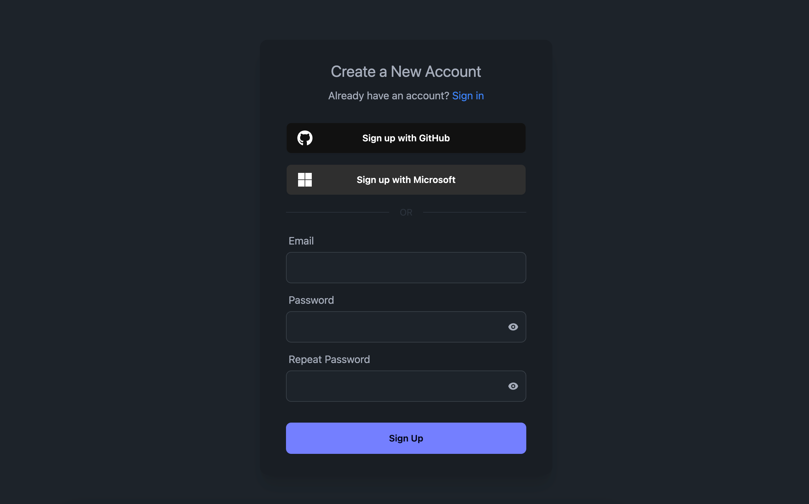

# Stack

Stack is an open-source, self-hostable, and highly customizable authentication and user management system. We currently provide libraries for Next.js, React, and JavaScript. You can set it up in one minute and scale with the project as it grows.

## Features

- OAuth (Google, Facebook, GitHub, etc.)
- Email and password authentication
- Email verification
- Password reset
- User management

## Getting Started

To get started with Stack, you need to have [Next.js](https://nextjs.org/docs) setup for you project. If you are starting from scratch, run the following command to create a new Next.js project:
  
```bash
### TODO
```

Once you have your Next.js project setup, you can install Stack by running the following command:

```bash
### TODO
```

## Setup

// TODO (this doesn't work yet)

1. Register an account on Stack [here](https://stackframe.co) if you don't already have and account. (Or got to [self-hosting](#self-hosting) section if you want to host the server yourself) Create an project in the dashboard, and put the Project ID, publishable client key, and secret server key in the `.env.local` file in the root of your Next.js project like this:

    ```javascript
    NEXT_PUBLIC_WEBLIT_PROJECT_ID=<your-project-id>
    NEXT_PUBLIC_WEBLIT_PUBLISHABLE_CLIENT_KEY=<your-publishable-client-key>
    WEBLIT_SECRET_SERVER_KEY=<your-secret-server-key>
    ```

2. Create `StackServerApp` in `lib/stack.ts`:
  
    ```tsx
    import { StackServerApp } from '@stack/next';

    export const stack = new StackServerApp({
      tokenStore: "nextjs-cookie", // storing auth tokens in cookies
    });
    ```
  
    This will create a server app that handles all the server side functions. You can import it from other files to use the functions bind to it.

3. Create a new file and its parent folders in the Next.js app folder: `app/handler/[...stack]/page.tsx`. Then add the following code to the file: 

    ```tsx
    import { StackHandler } from "stack";
    import { stackServerApp } from "lib/stack";

    export default function Handler(props) {
      return <StackHandler app={stackServerApp} {...props} />;
    }
    ```

    The handler will be handle all the pages like `signin`, `signup`, `password-reset`, etc. automatically for you. You can later customize and change the route of these pages easily.


4. In your `app/layout.tsx`, add the `StackProvider`, it should look something like this:
    ```tsx
    import { StackProvider } from '@stack/next';
    import { stack } from 'lib/stack';

    export default function Layout({ children }) {
      return (
        <html lang="en">
          <body>
            <StackProvider app={stack}>
              {children}
            </StackProvider>
          </body>
        </html>
      );
    }
    ```

    The provider will provide information to the frontend functions and hooks.

5. That's it! Stack is not configured in your Next.js project. If you start your Next.js app with `npm run dev`, and navigate to `http://localhost:3000/handler/signup`, you should see the Stack signup page liek this:
    


## Development setup & self-hosting

This is for you if you want to contribute to the Stack project or just want to run the server locally.

Make sure you have `pnpm` installed alongside Node v20. Next, ensure you created `.env.local` files by copying `.env` in each of the subpackages in the `packages` folder and filling out the variables. You will need to start a Postgres database; you can do this with the following command:

```sh
docker run -it --rm -e POSTGRES_PASSWORD=password -p "5432:5432" postgres
```

Then:

```sh
pnpm install

# Run code generation (repeat this after eg. changing the Prisma schema)
pnpm run codegen

# After starting a Postgres database and filling the corresponding variables in .env.local, push the schema to the database:
pnpm run prisma:server -- db reset

# Start the dev server
pnpm run dev
```

To do linting and typechecking:

```sh
pnpm run codegen
```

You can also open Prisma Studio to see the database interface and edit data directly:

```sh
pnpm run prisma:server -- studio
```
