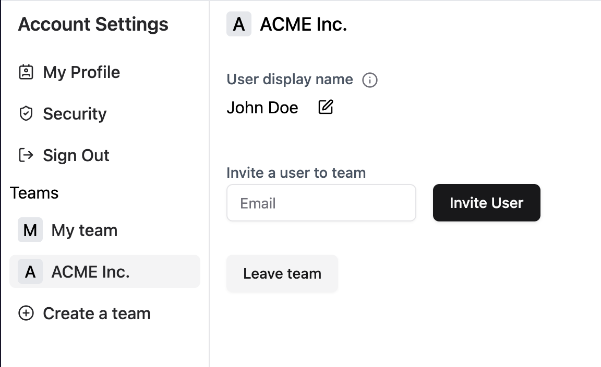

<h3 align="center">
  <a href="https://docs.stack-auth.com">📘 Docs</a>
  | <a href="https://stack-auth.com/">☁️ Hosted Version</a>
  | <a href="https://demo.stack-auth.com/">✨ Demo</a>
  | <a href="https://discord.stack-auth.com">🎮 Discord</a>
</h4>

# Stack Auth: Open-source Clerk/Auth0 alternative

Stack Auth is a managed user authentication solution. It is developer-friendly and fully open-source (licensed under MIT and AGPL).

Stack gets you started in just five minutes, after which you'll be ready to use all of its features as you grow your project. Our managed service is completely optional and you can export your user data and self-host, for free, at any time.

We support Next.js frontends, along with any backend that can use our [REST API](https://docs.stack-auth.com/rest-api/auth). Check out our [setup guide](https://docs.stack-auth.com/getting-started/setup) to get started.

<div align="center">

</div>

## ✨ Features

| | |
|-|:-:|
| <h3>`<SignIn/>` and `<SignUp/>`</h3> Authentication components that support OAuth, password credentials, and magic links. All customizable on the dashboard, with shared development keys avoiding extra setup. All the components support dark/light modes. |  |
| <h3>Idiomatic Next.js APIs</h3> We build on server components, React hooks, and route handlers. |  |
| <h3>User dashboard</h3> Dashboard to filter, analyze, and edit users. Replaces the first internal tool you would've had to build. |  |
| <h3>Account settings</h3> Let users update their profile, verify their e-mail, or change their password with zero setup. |  |
| <h3>Multi-tenancy & teams</h3> Manage your B2B customers with an organization structure that makes sense and scales to millions. |  |
| <h3>Role-based access control</h3> Define an arbitrary permission graph and assign it to users. Fetching whether permissions exist is just a single line of code. |  |
| <h3>OAuth Providers</h3>Stack not only supports OAuth login but also provides access tokens management for third-party APIs such as Outlook and Google Calendar. We handle token refreshes and scope control for you and you can call an simple API to get the access token |  |
| <h3>Impersonation</h3> Impersonate users for debugging and support, logging into their account as if you were them. |  |
| <h3>Webhooks</h3> Get notified when users use your product, built on Svix. |  |
| <h3>Automatic emails</h3> Send customizable emails on triggers such as sign-up, password reset, and email verification, editable with a WYSIWYG editor. |  |
| <h3>User session & JWT handling</h3> Stack handles all the refresh/access token, JWTs, and cookies, so you can get the best performance at no implementation cost. |  |

## 📦 Installation & Setup

Refer to [our documentation](https://docs.stack-auth.com/getting-started/setup) on how to set up Stack Auth in your Next.js project.

## 🌱 Some community projects built with Stack

- [Next SaaSkit by wolfgunblood](https://github.com/wolfgunblood/nextjs-saaskit)
- [Stack Example by career-tokens](https://github.com/career-tokens/StackYCAuth)

## 🏗️ Development & Contribution

This is for you if you want to contribute to the Stack project or run the Stack dashboard locally.

<details>
  <summary>Local setup</summary>

Please read the [contribution guidelines](CONTRIBUTING.md) before contributing.

### Requirements

- Node v20
- pnpm v9
- Docker

### Setup

Pre-populated .env files for the setup below are available and used by default in `.env.development` in each of the packages. You should copy all the `.env.development` files to `.env.local` in the respective packages for local development.

In a terminal, start the dependencies (Postgres and Inbucket) as Docker containers:

```sh
docker compose -f dependencies.compose.yaml up
```

Then open a new terminal:

```sh
pnpm install

# Run build to build everything once
pnpm run build

# initialize the database and seed it with some data
pnpm prisma db push
pnpm prisma db seed

# Run code generation (repeat this after eg. changing the Prisma schema). This is part of the build script, but faster
pnpm run codegen

# Start the dev server
pnpm run dev

# In a different terminal, run tests in watch mode
pnpm run test
```

You can now open the dashboard at [http://localhost:8101](http://localhost:8101), API on port 8102, demo on port 8103, docs on port 8104, Inbucket (e-mails) on port 8105, and Prisma Studio on port 8106.

Your IDE may show an error on all `@stackframe/XYZ` imports. To fix this, simply restart the TypeScript language server; for example, in VSCode you can open the command palette (Ctrl+Shift+P) and run `Developer: Reload Window` or `TypeScript: Restart TS server`.

You can also open Prisma Studio to see the database interface and edit data directly:

```sh
pnpm run prisma studio
```

### Database migrations

If you make changes to the Prisma schema, you need to run the following command to create a migration:

```sh
pnpm run prisma migrate dev
```
</details>

## Contributors

**Important**: Please read the [contribution guidelines](CONTRIBUTING.md) carefully and join [our Discord](https://discord.stack-auth.com) if you'd like to help.

Thanks to the amazing community who built Stack:

<a href="https://github.com/stack-auth/stack/graphs/contributors">
  
</a>
