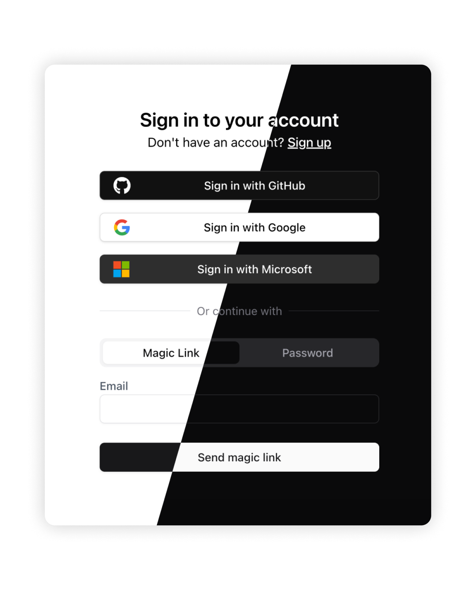
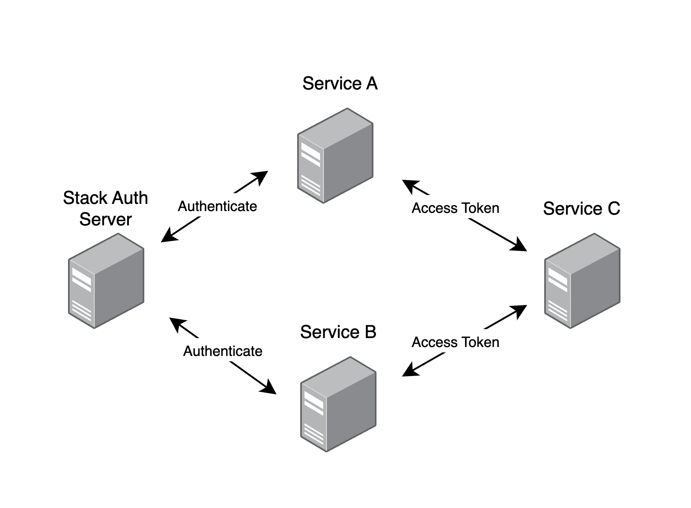

[](https://stack-auth.com)

<h3 align="center">
  <a href="https://docs.stack-auth.com">📘 Docs</a>
  | <a href="https://stack-auth.com/">☁️ Hosted Version</a>
  | <a href="https://demo.stack-auth.com/">✨ Demo</a>
  | <a href="https://discord.stack-auth.com">🎮 Discord</a>
</h4>

# Stack Auth: Open-source Clerk/Auth0 alternative

Stack Auth is a managed user authentication solution. It is developer-friendly and fully open-source (licensed under MIT and AGPL).

Stack gets you started in just five minutes, after which you'll be ready to use all of its features as you grow your project. Our managed service is completely optional and you can export your user data and self-host, for free, at any time.

We support Next.js frontends, along with any backend that can use our [REST API](https://docs.stack-auth.com/rest-api/overview). Check out our [setup guide](https://docs.stack-auth.com/getting-started/setup) to get started.

<div align="center">

</div>

## Table of contents

<!-- START doctoc generated TOC please keep comment here to allow auto update -->
<!-- DON'T EDIT THIS SECTION, INSTEAD RE-RUN doctoc TO UPDATE -->

- [How is this different from X?](#how-is-this-different-from-x)
- [✨ Features](#-features)
- [📦 Installation & Setup](#-installation--setup)
- [🌱 Some community projects built with Stack](#-some-community-projects-built-with-stack)
  - [Templates](#templates)
  - [Examples](#examples)
- [🏗 Development & Contribution](#-development--contribution)
  - [Requirements](#requirements)
  - [Setup](#setup)
  - [Database migrations](#database-migrations)
  - [Chat with the codebase](#chat-with-the-codebase)
  - [Architecture overview](#architecture-overview)
- [❤ Contributors](#-contributors)

<!-- END doctoc generated TOC please keep comment here to allow auto update -->

## How is this different from X?

Ask yourself about `X`:

- Is `X` open-source?
- Is `X` developer-friendly, well-documented, and lets you get started in minutes?
- Besides authentication, does `X` also do authorization and user management (see feature list below)?

If you answered "no" to any of these questions, then that's how Stack Auth is different from `X`.

## ✨ Features

To get notified first when we add new features, please subscribe to [our newsletter](https://stack-auth.beehiiv.com/subscribe).

| | |
|-|:-:|
| <h3>`<SignIn/>` and `<SignUp/>`</h3> Authentication components that support OAuth, password credentials, and magic links, with shared development keys to make setup faster. All components support dark/light modes. |  |
| <h3>Idiomatic Next.js APIs</h3> We build on server components, React hooks, and route handlers. |  |
| <h3>User dashboard</h3> Dashboard to filter, analyze, and edit users. Replaces the first internal tool you would have to build. |  |
| <h3>Account settings</h3> Lets users update their profile, verify their e-mail, or change their password. No setup required. |  |
| <h3>Multi-tenancy & teams</h3> Manage B2B customers with an organization structure that makes sense and scales to millions. |  |
| <h3>Role-based access control</h3> Define an arbitrary permission graph and assign it to users. Organizations can create org-specific roles. |  |
| <h3>OAuth Connections</h3>Beyond login, Stack can also manage access tokens for third-party APIs, such as Outlook and Google Calendar. It handles refreshing tokens and controlling scope, making access tokens accessible via a single function call. |  |
| <h3>Passkeys</h3> Support for passwordless authentication using passkeys, allowing users to sign in securely with biometrics or security keys across all their devices. |  |
| <h3>Impersonation</h3> Impersonate users for debugging and support, logging into their account as if you were them. |  |
| <h3>Webhooks</h3> Get notified when users use your product, built on Svix. |  |
| <h3>Automatic emails</h3> Send customizable emails on triggers such as sign-up, password reset, and email verification, editable with a WYSIWYG editor. |  |
| <h3>User session & JWT handling</h3> Stack manages refresh and access tokens, JWTs, and cookies, resulting in the best performance at no implementation cost. |  |
| <h3>M2M authentication</h3> Use short-lived access tokens to authenticate your machines to other machines. |  |


## 📦 Installation & Setup

1. Run Stack’s installation wizard with the following command:
    ```bash
    npx @stackframe/init-stack@latest
    ```
2. Then, create an account on the [Stack Auth dashboard](https://app.stack-auth.com/projects), create a new project with an API key, and copy its environment variables into the .env.local file of your Next.js project:
    ```
    NEXT_PUBLIC_STACK_PROJECT_ID=<your-project-id>
    NEXT_PUBLIC_STACK_PUBLISHABLE_CLIENT_KEY=<your-publishable-client-key>
    STACK_SECRET_SERVER_KEY=<your-secret-server-key>
    ```
3. That's it! You can run your app with `npm run dev` and go to [http://localhost:3000/handler/signup](http://localhost:3000/handler/signup) to see the sign-up page. You can also check out the account settings page at [http://localhost:3000/handler/account-settings](http://localhost:3000/handler/account-settings).

Check out the [documentation](https://docs.stack-auth.com/getting-started/setup) for a more detailed guide.

## 🌱 Some community projects built with Stack

Have your own? Happy to feature it if you create a PR or message us on [Discord](https://discord.stack-auth.com).

### Templates
- [Stack Template by Stack Team](https://github.com/stack-auth/stack-auth-template)
- [Next SaaSkit by wolfgunblood](https://github.com/wolfgunblood/nextjs-saaskit)
- [SaaS Boilerplate by Robin Faraj](https://github.com/robinfaraj/saas-boilerplate)

### Examples
- [Stack Example by career-tokens](https://github.com/career-tokens/StackYCAuth)
- [Stack Demo by the Stack team](https://github.com/stack-auth/stack-auth/tree/dev/examples/demo)
- [Stack E-Commerce Example by the Stack team](https://github.com/stack-auth/stack-auth/tree/dev/examples/e-commerce)

## 🏗 Development & Contribution

This is for you if you want to contribute to the Stack project or run the Stack dashboard locally.

**Important**: Please read the [contribution guidelines](CONTRIBUTING.md) carefully and join [our Discord](https://discord.stack-auth.com) if you'd like to help.

### Requirements

- Node v20
- pnpm v9
- Docker

### Setup

Pre-populated .env files for the setup below are available and used by default in `.env.development` in each of the packages. (Note: If you're creating a production build (eg. with `pnpm run build`), you must supply the environment variables manually.)

In a new terminal:

```sh
pnpm install

# Build the packages and generate code. We only need to do this once, as `pnpm dev` will do this from now on
pnpm build:packages
pnpm codegen

# Reset & start the dependencies (DB, Inbucket, etc.) as Docker containers, seeding the DB with the Prisma schema
pnpm start-deps
# pnpm run restart-deps
# pnpm run stop-deps

# Start the dev server
pnpm dev
# For systems with limited resources, you can run a minimal development setup with just the backend and dashboard
# pnpm run dev:basic

# In a different terminal, run tests in watch mode
pnpm test
```

You can now open the dev launchpad at [http://localhost:8100](http://localhost:8100). From there, you can navigate to the dashboard at [http://localhost:8101](http://localhost:8101), API on port 8102, demo on port 8103, docs on port 8104, Inbucket (e-mails) on port 8105, and Prisma Studio on port 8106. See the dev launchpad for a list of all running services.

Your IDE may show an error on all `@stackframe/XYZ` imports. To fix this, simply restart the TypeScript language server; for example, in VSCode you can open the command palette (Ctrl+Shift+P) and run `Developer: Reload Window` or `TypeScript: Restart TS server`.

You can also open Prisma Studio to see the database interface and edit data directly:

```sh
pnpm run prisma studio
```


### Database migrations

If you make changes to the Prisma schema, you need to run the following command to create a migration:

```sh
pnpm run prisma migrate dev
```

### Chat with the codebase

Storia trained an [AI on our codebase](https://sage.storia.ai/stack-auth) that can answer questions about using and contributing to Stack.

### Architecture overview


Thanks to [CodeViz](https://www.codeviz.ai) for generating the diagram!

## ❤ Contributors

<a href="https://github.com/stack-auth/stack-auth/graphs/contributors">
  
</a>
