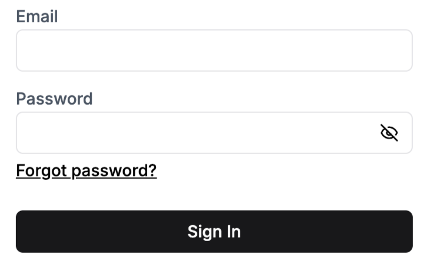

A component that renders a sign-in form with email and password fields.

<div className="stack-white-image-showcase">
  
</div>

Note that if credential sign-in is disabled in the dashboard, this component will still render. However, attempting to use it will result in an error being thrown.

For more information, please refer to the [custom pages guide](../customization/custom-pages.mdx).

## Props

This component does not accept any props.

## Example

```tsx
import { CredentialSignIn } from '@stackframe/stack';

export default function Page() {
  return (
    <div>
      <h1>Sign In</h1>
      <CredentialSignIn />
    </div>
  );
}
```
