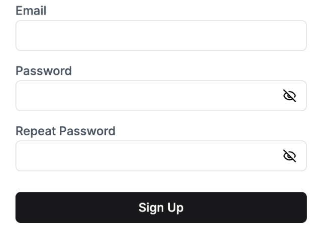

A component that renders a sign-up form with email and password fields.



Note that if credential sign-up is disabled in the dashboard, this component will still render. However, attempting to use it will result in an error being thrown.

For more information, please refer to the [custom pages guide](../customization/custom-pages.mdx).

## Props

- `noPasswordRepeat` (optional): `boolean` - If set to `true`, the form will not include a password repeat field.

## Example

```tsx
import { CredentialSignUp } from '@stackframe/stack';

export default function Page() {
  return (
    <div>
      <h1>Sign Up</h1>
      <CredentialSignUp noPasswordRepeat />
    </div>
  );
}
```