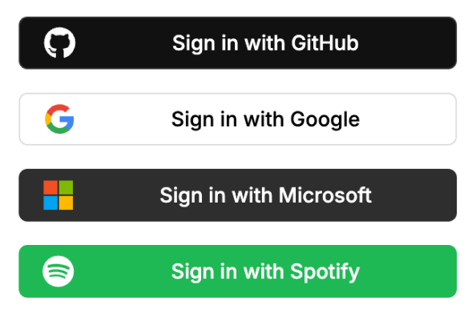

Renders all the available OAuth buttons for sign-in or sign-up functionality.



Note that if there are no OAuth providers enabled in the dashboard, this component will be empty.

## Props

- `type`: `'sign-in' | 'sign-up'` - Specifies whether the buttons text are for sign-in or sign-up (both are the same in terms of functionality).

## Example

```tsx
import { OAuthButtonGroup } from '@stackframe/stack';

export default function Page() {
  return (
    <div>
      <h1>Sign In</h1>
      <OAuthButtonGroup type='sign-in' />
    </div>
  );
}

```