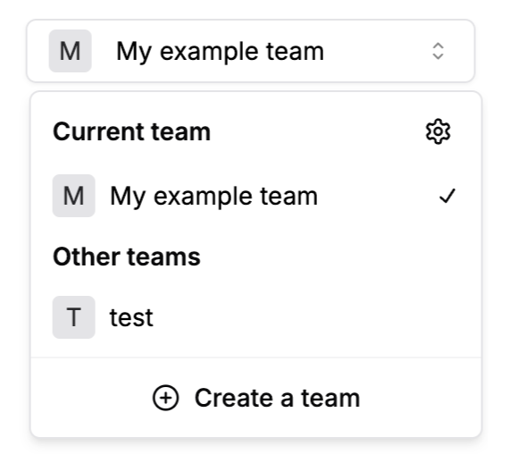

A React component for switching between teams. It displays a dropdown of teams and allows the user to select a team.

<div className="stack-white-image-showcase">
  
</div>

For a comprehensive guide on using this component, refer to our [Team Selection documentation](../concepts/team-selection.mdx).

## Props

- `urlMap` (optional): `(team: Team) => string` - A function that maps a team to a URL. If provided, the component will navigate to this URL when a team is selected.
- `selectedTeam` (optional): `Team` - The initially selected team.
- `noUpdateSelectedTeam` (optional): `boolean` - If true, prevents updating the selected team in the user's settings when a new team is selected. Default is false.

## Example

```tsx
import { SelectedTeamSwitcher } from '@stackframe/stack';

export default function Page() {
  return (
    <div>
      <h1>Team Switcher</h1>
      <SelectedTeamSwitcher
        urlMap={(team) => `/team/${team.id}`}
        selectedTeam={currentTeam}
        noUpdateSelectedTeam={false}
      />
    </div>
  );
}
```
