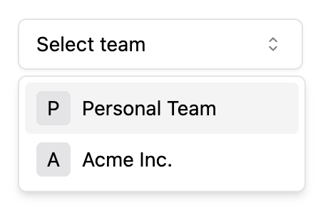

A user can be a member of multiple teams, so most websites using teams will need a way to select a "current team" that the user is working on. There are two primary methods to accomplish this:

- **Deep Link**: Each team has a unique URL, for example, `your-website.com/team/<team-id>`. When a team is selected, it redirects to a page with that team's URL.
- **Current Team**: When a user selects a team, the app stores the team as a global "current team" state. In this way, the URL of the current team might be something like `your-website.com/current-team`, and the URL won't change after switching teams.

## Deep Link Method
The deep link method is generally recommended because it avoids some common issues associated with the current team method. If two users share a link while using deep link URLs, the receiving user will always be directed to the correct team's information based on the link. 

## Current Team Method
While the current team method can be simpler to implement, it has a downside. If a user shares a link, the recipient might see information about the wrong team (if their "current team" is set differently). This method can also cause problems when a user has multiple browser tabs open with different teams.

## Selected Team Switcher

To facilitate team selection, Stack provides a component that looks like this:



You can import and use the `SelectedTeamSwitcher` component for the "current team" method. It updates the `selectedTeam` when a user selects a team:

```jsx 
import { SelectedTeamSwitcher } from "@stackframe/stack";

export function MyPage() {
  return (
    <div>
      <SelectedTeamSwitcher/>
    </div>
  );
}
```

To combine the switcher with the deep link method, you can pass in `urlMap` and `selectedTeam`. The `urlMap` is a function to generate a URL based on the team information, and `selectedTeam` is the team that the user is currently working on. This lets you implement "deep link" + "most recent team". The component will update the `user.selectedTeam` with the `selectedTeam` prop:

```jsx
<SelectedTeamSwitcher 
  urlMap={team => `/team/${team.id}`} 
  selectedTeam={team}
/>
```

To implement the "deep link" + "default team" method, where you update the `selectedTeam` only when the user clicks "set to default team" or similar, pass `noUpdateSelectedTeam`:

```jsx
<SelectedTeamSwitcher 
  urlMap={team => `/team/${team.id}`} 
  selectedTeam={team} 
  noUpdateSelectedTeam
/>
```

## Example: Deep Link + Most Recent Team

First, create a page at `/app/team/[teamId]/page.tsx` to display information about a specific team:

```jsx title="/app/team/[teamId]/page.tsx" 
"use client";

import { useUser, SelectedTeamSwitcher } from "@stackframe/stack";

export default function TeamPage({ params }: { params: { teamId: string } }) {
  const user = useUser({ or: 'redirect' });
  const team = user.useTeam(params.teamId);

  if (!team) {
    return <div>Team not found</div>;
  }

  return (
    <div>
      <SelectedTeamSwitcher 
        urlMap={team => `/team/${team.id}`} 
        selectedTeam={team}
      />
      
      <p>Team Name: {team.displayName}</p>
      <p>You are a member of this team.</p>
    </div>
  );
}
```

Next, create a page to display all teams at `/app/team/page.tsx`:

```jsx title="/app/team/page.tsx"
"use client";

import { useRouter } from "next/navigation";
import { useUser } from "@stackframe/stack";

export default function TeamsPage() {
  const user = useUser({ or: 'redirect' });
  const teams = user.useTeams();
  const router = useRouter();
  const selectedTeam = user.selectedTeam;

  return (
    <div>
      {selectedTeam && 
        <button onClick={() => router.push(`/team/${selectedTeam.id}`)}>
          Most recent team
        </button>}

      <h2>All Teams</h2>
      {teams.map(team => (
        <button key={team.id} onClick={() => router.push(`/team/${team.id}`)}>
          Open {team.displayName}
        </button>
      ))}
    </div>
  );
}
```

Now, if you navigate to `http://localhost:3000/team`, you should be able to see and interact with the teams.