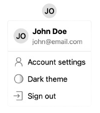

In [the last guide](./setup.mdx), we initialized Stack. This time, we will take a quick look at some of the most useful Next.js components.

For the full documentation of all available components, please refer to the [components reference](/components).

## `<UserButton />`

The `<UserButton />` component shows the user's avatar and opens a dropdown with various user settings.



```tsx title="page.tsx"
import { UserButton } from '@stackframe/stack';

export default function Page() {
  return (
    <UserButton />
  );
}
```

## `<SignIn />` and `<SignUp />`

These components show a sign-in and sign-up form, respectively.


```tsx title="page.tsx"
import { SignIn } from '@stackframe/stack';

export default function Page() {
  return (
    <SignIn />
  );
}
```

All of Stack's components are modular and built from smaller primitives. For example, the `<SignIn />` component is composed of the following:

- An `<OAuthButtonGroup />`, which itself is composed of multiple `<OAuthButton />` components
- A `<MagicLinkSignIn />`, which has a text field and calls `useStackApp().signInWithMagicLink()`
- A `<CredentialSignIn />`, which has two text fields and calls `useStackApp().signInWithCredential()`

You can use these components individually to build a custom sign-in component.

To change the default sign-in URL to your own, see the documentation on [custom pages](/customization/custom-pages).

## Others

Stack has many more components available. For a comprehensive list, please check the documentation on [components](/components).

## Next steps

In the next guide, we will do a deep-dive into retrieving and modifying user objects, as well as how to protect a page.
