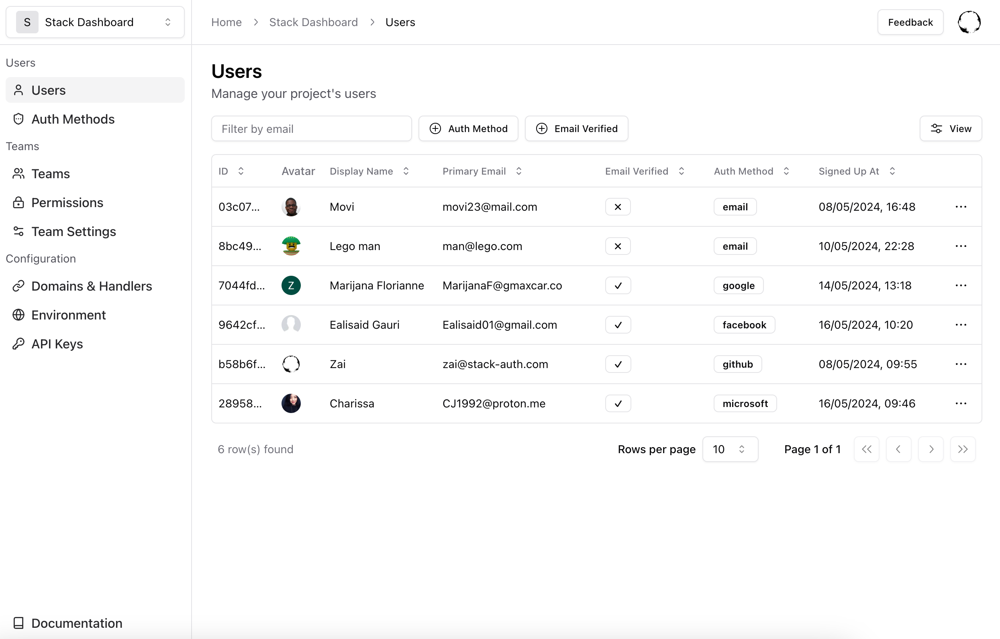

<CardGroup>
    <Card 
        title="Setup Guide"
        icon="fa-regular fa-play" 
        href="../getting-started/setup"
    >
      Setup Stack in your project
    </Card>
    <Card 
        title="SDK Reference"
        icon="fa-regular fa-file-lines" 
        href="../sdk"
    >
      Learn how to use Stack's SDKs for Next.js
    </Card>
    <Card 
        title="REST API Reference"
        icon="fa-solid fa-code" 
        href="/rest-api"
    >
      Explore Stack's REST API for frameworks that aren't natively supported yet
    </Card>
    <Card 
        title="Discord"
        icon="fa-brands fa-discord"
        href="https://discord.stack-auth.com"
    >
      Join our Discord community
    </Card>
</CardGroup>

## Why Stack?

Authentication is inherently difficult. There are only few things more sensitive than user data, and only few things more difficult than cryptography. It's not surprising that a majority of online businesses struggle to get it right.

The optimal authentication solution is secure, yet approachable. If a developer has to worry about JWTs, OAuth flows, or password hashing, then we have failed. If an authentication solution uses closed-source, unauditable code for the most critical parts of your application, then we have failed.

The truth is; as the authentication services industry, we have collectively failed. It is dominated by proprietary giants with predatory "bait-and-switch" pricing who provide no transparency into their codebase, and a terrible developer experience because they have determined that enterprises are willing to pay more if setting up auth systems is painful.

That's why we built Stack. Integrating secure authentication into your app should be a matter of **5 minutes**, rather than 5 days.

At the core of this are deep integrations into frontend and backend frameworks. We give the best developer experience to anyone using our supported tech stacks; at the moment, this is Next.js with Postgres and TypeScript or Python backends. Instead of giving mediocre support for a lot of frameworks, we chose to make a few integrations as excellent as possible before adding new ones (though we do offer a cross-compatible REST API as a fallback).

Here is an example. To retrieve the current user, simply call:
  
```tsx
export function MyComponent() {
  const user = useUser({ or: "redirect" });
  return <div>{user ? `Hi, ${user.displayName}` : 'You are not logged in'}</div>;
}
```

That's it! Stack will either return a User object or redirect the user to the login page.

You can also add a button to change the user's name:

```tsx
<button onClick={async () => await user.update({ displayName: "New Name" })}>
  Change Name
</button>
```
The user data will update in both the frontend and backend automatically. The updated user data will be reflected in all other components on your page as well.

You also get pages and components for authentication flow out-of-the-box. This is the sign-in page that you get without writing a single line of code:


Notably, there's no branding on any of our components. We believe that we should grow by building the best product, not by forcing our brand on your users — but this means that we **rely on you to spread the word about Stack**. If you like what you're reading, we'd love if you could take a second to tell one or two of your friends about us.

If you prefer a fully customized UI, you can use our low-level functions like `signInWithOAuth` or `signInWithCredential` to build your own sign-in page:

```tsx
export default function CustomOAuthSignIn() {
  const app = useStackApp();
  return <div>
    <button onClick={async () => await app.signInWithOAuth('google')}>
      Sign In with Google
    </button>
  </div>;
}
```

To manage everything efficiently, there is a powerful admin dashboard:



Best of all, Stack is **100% open-source**. That means client, server, dashboard, and even this very documentation you're reading right now. Feel free to check out our [GitHub](https://github.com/stack-auth/stack) and open an issue or pull request.

This is just a glimpse of what Stack can do. Stack also handles many other tasks like backend integration, data storage, emails, teams, permissions, and more, which you will learn later in the documentation.

If this sounds interesting, [get started](../getting-started/setup.mdx) with our interactive setup wizard, or join [our Discord community](https://discord.stack-auth.com) to ask questions and get help from our team.

We're excited to have you on board! 🚀
