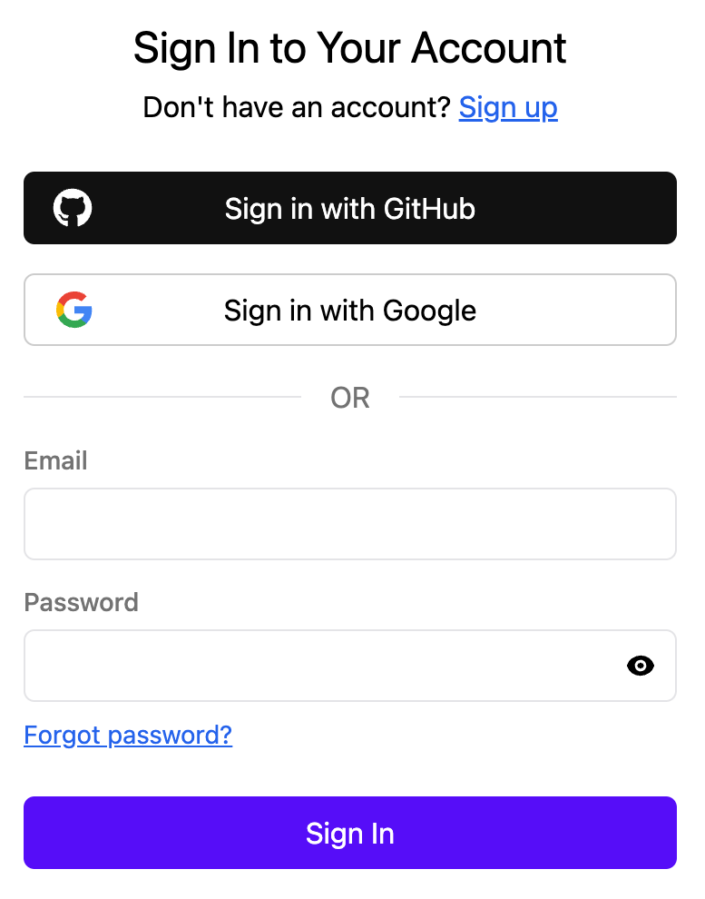

<CardGroup>
    <Card 
        title="Setup Guide"
        icon="fa-regular fa-play" 
        href="./setup.mdx"
    >
      Setup Stack in your project
    </Card>
    <Card 
        title="SDK Reference"
        icon="fa-regular fa-file-lines" 
        href="../sdk/user.mdx"
    >
      Learn how to use Stack SDKs
    </Card>
    <Card 
        title="API Reference"
        icon="fa-solid fa-code" 
        href="/rest-api"
    >
      Explore Stack REST API
    </Card>
    <Card 
        title="Discord"
        icon="fa-brands fa-discord"
        href="https://discord.stack-auth.com"
    >
      Join our Discord community
    </Card>
</CardGroup>

## Why Stack?

You might wonder: "With so many authentication libraries available, why create Stack?"

The answer is straightforward: **They all suck at developer experience**.

As developers, we don't want to be bothered by decisions about using JWT or session tokens, handling token refreshes, or managing user data synchronization with frontend states. **Auth should be a 5 minutes job**, not 5 days. Our focus should be on building the core product.

Stack abstract all these complexities away by deeply integrate into the frontend and backend framework. It offers a simple and intuitive interface, while remains highly flexible, customizable, and powerful.

Here is an example. To use the current user, simply call:
  
```tsx
export function MyComponent() {
  const user = useUser();
  return <div>{user ? `Hi, ${user.displayName}` : 'You are not logged in'}</div>;
}
```

That's it! You don't need to worry about fetching the user, storing the user data, handling loading states, or refreshing user data. Stack manages all of that for you.

You can also add a button to change the user's name:

```tsx
<button onClick={async () => await app.update({ displayName: "New Name" })}>
  Change Name
</button>
```
The user data will be updated in both the frontend and backend automatically. The updated user data will also reflect in `MyComponent` as well.

You also get pages and components for authentication flow out-of-the-box. This for example the sign-in page is what you get without writing a single line of code:



If you prefer a fully customized UI, you can use our low-level functions like `signInWithOAuth` or `signInWithCredential` to build your own sign-in page:

```tsx
export default function CustomOAuthSignIn() {
  const app = useStackApp();
  return <div>
    <button onClick={async () => await app.signInWithOAuth('google')}>
      Sign In with Google
    </button>
  </div>;
}
```

To manage everything efficiently, there is a powerful admin dashboard:


Best of all, Stack is **100% open-source**.

This is just a glimpse of what Stack can do. Stack also handles many other tasks like backend integration, data storage, emails, teams, permissions, and more, which you will learn later in the documentation.

If this sounds interesting, let's get started with setting up Stack in your project!
