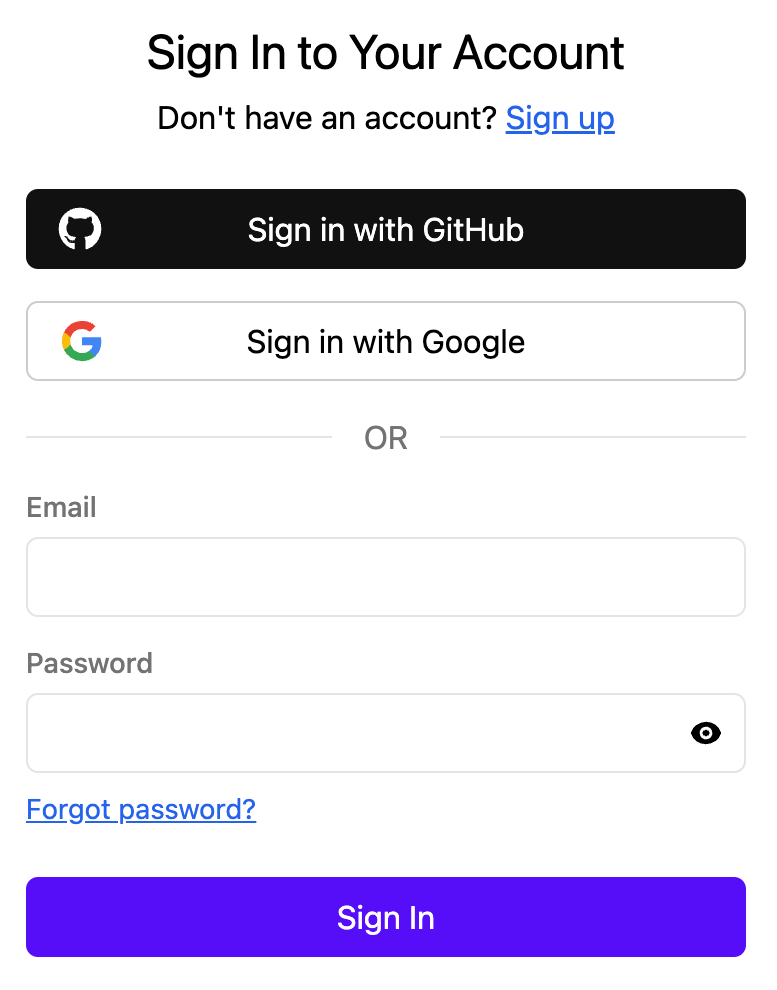
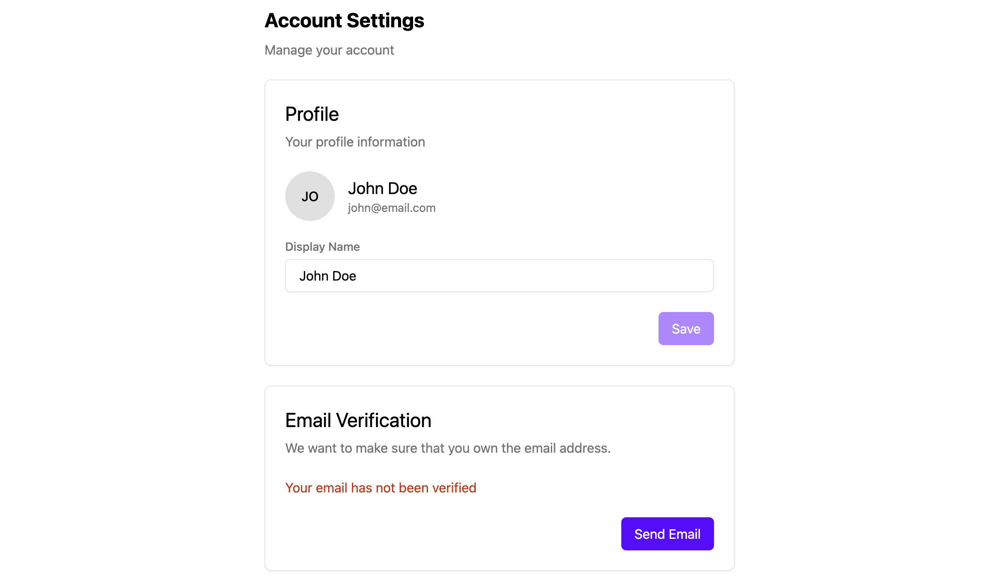

## Setup

To get started with Stack, you need to create a [Next.js](https://nextjs.org/docs) project with the App router. If you are starting from scratch, you can just run the following:
  
```sh title="Terminal"
npx create-next-app@latest --app stack-example
cd stack-example
npx @stackframe/init-stack@latest
```

If you are adding Stack to an existing project, you can choose between two ways to install Stack: the setup wizard or manual installation. We recommend using the setup wizard first. However, if you have a non-standard project structure or the setup wizard doesn't work for you, you can follow the manual installation guide.

<Tabs>
  <Tab title="Setup wizard (Recommended)">

You can run Stack's installation wizard with the following command:

```sh title="Terminal"
npx @stackframe/init-stack@latest
```

You will be guided through the installation process. To complete it, you must create an account on [our dashboard](https://app.stack-auth.com/projects), create a new project with an API key, and copy the project ID, publishable client key, and secret server key into the `.env.local` file in the root of your Next.js project:

```sh title=".env.local"
NEXT_PUBLIC_STACK_PROJECT_ID=<your-project-id>
NEXT_PUBLIC_STACK_PUBLISHABLE_CLIENT_KEY=<your-publishable-client-key>
STACK_SECRET_SERVER_KEY=<your-secret-server-key>
```

  </Tab>

  <Tab title="Manual installation">

First, install Stack with npm, yarn, or pnpm:

```bash title="Terminal"
npm install @stackframe/stack
```

1. If you haven't already, [register a new account on Stack](https://app.stack-auth.com/handler/signup). Create a project in the dashboard, create a new API key from the left sidebar, and copy the project ID, publishable client key, and secret server key into a new file called `.env.local` in the root of your Next.js project:

    ```sh title=".env.local"
    NEXT_PUBLIC_STACK_PROJECT_ID=<your-project-id>
    NEXT_PUBLIC_STACK_PUBLISHABLE_CLIENT_KEY=<your-publishable-client-key>
    STACK_SECRET_SERVER_KEY=<your-secret-server-key>
    ```

2. Create a new file `stack.ts` in your root directory and fill it with the following:
  
    ```tsx title="stack.ts"
    import "server-only";
    import { StackServerApp } from "@stackframe/stack";

    export const stackServerApp = new StackServerApp({
      tokenStore: "nextjs-cookie", // storing auth tokens in cookies
      //there is other parameter named "urls" which is covered later in the docs
    });
    ```
  
    This will read the environment variables automatically and create a server app that you can later use to access Stack from your Next.js server.
    
    Check out the [`StackServerApp` documentation](../sdk/app.mdx) to learn more about its other options.

3. Create a new file in `app/handler/[...stack]/page.tsx` and paste the following code: 

    ```tsx title="app/handler/[...stack]/page.tsx"
    import { StackHandler } from "@stackframe/stack";
    import { stackServerApp } from "@/stack";

    export default function Handler(props: any) {
      return <StackHandler fullPage app={stackServerApp} {...props} />;
    }
    ```

    This will create pages for sign-in, sign-up, password reset, and others. Additionally, it will be used as a callback URL for OAuth. You can [replace them with your own pages](/docs/customization/overview) later.


4. In your `app/layout.tsx`, wrap the entire body with a `StackProvider` and `StackTheme`. Afterwards, it should look like this:

    ```tsx title="app/layout.tsx"
    import React from "react";
    import { StackProvider, StackTheme } from "@stackframe/stack";
    import { stackServerApp } from "@/stack";

    export default function RootLayout({ children }: { children: React.ReactNode }) {
      return (
        <html lang="en">
          <body>
            <StackProvider app={stackServerApp}>
              <StackTheme>
                {children}
              </StackTheme>
            </StackProvider>
          </body>
        </html>
      );
    }
    ```

5. By default, Stack uses [`Suspense`](https://react.dev/reference/react/Suspense) to handle loading states. To show a loading indicator while Stack is fetching user data, make sure there is a `loading.tsx` file in your `app` directory:

    ```tsx title="app/loading.tsx"
    export default function Loading() {
      // You can use any loading indicator here
      return <>
        Loading...
      </>;
    }
    ```
  </Tab>
</Tabs>

That's it! Stack is now configured in your Next.js project. If you start your Next.js app with `npm run dev` and navigate to [http://localhost:3000/handler/signup](http://localhost:3000/handler/signup), you will see the Stack sign-up page.



After signing up/in, you will be redirected back to the home page. We will show you how to add useful information to it in the next section. You can also check out the [http://localhost:3000/handler/account-settings](http://localhost:3000/handler/account-settings) page which looks like this:




## Next steps

Next, we will show you how to get user information, protect a page, and store/retrieve user information in code.
