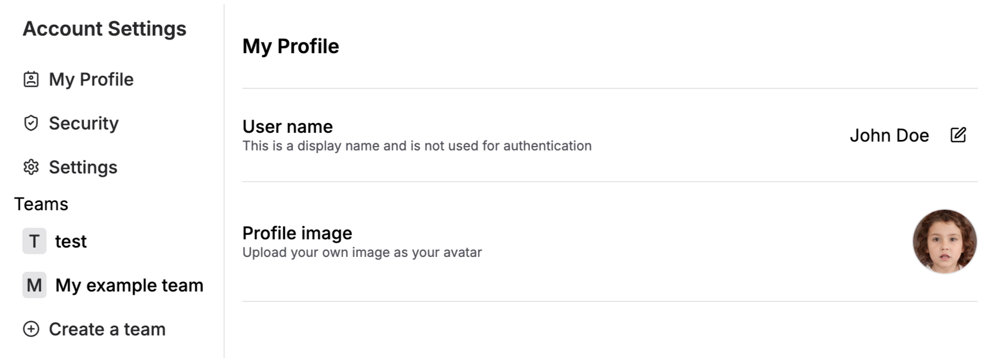

## Setup

<Info>
This is the setup guide for Next.js. If you are looking for the setup guide for vanilla JavaScript, check out the [JavaScript Client Guide](../others/js-client.mdx).
</Info>

To get started with Stack Auth, you need a [Next.js project](https://nextjs.org/docs/getting-started/installation) with the app router. The pages router is not supported.

We recommend using our **setup wizard**, which will automatically detect your project structure and guide you through the installation process. In case it fails, you can choose to do the manual installation instead.

<Tabs style={{backgroundColor: "black"}}>
  <Tab title="Setup wizard (recommended)">
    <Steps>
      ### Run installation wizard
      Run Stack's installation wizard with the following command:

      ```sh title="Terminal"
      npx @stackframe/init-stack@latest
      ```

      ### Update API keys
      Then, create an account on [the Stack Auth dashboard](https://app.stack-auth.com/projects), create a new project with an API key, and copy its environment variables into the `.env.local` file of your Next.js project:

      ```sh title=".env.local"
      NEXT_PUBLIC_STACK_PROJECT_ID=<your-project-id>
      NEXT_PUBLIC_STACK_PUBLISHABLE_CLIENT_KEY=<your-publishable-client-key>
      STACK_SECRET_SERVER_KEY=<your-secret-server-key>
      ```

      ### Done!
      That's it! The following files should have been created or updated in your project:

      - `app/handler/[...stack]/page.tsx`: This file contains the default pages for sign-in, sign-out, account settings, and more. If you prefer, later you will learn how to [use custom pages](/customization/custom-pages) instead.
      - `app/layout.tsx`: The layout file was updated to wrap the entire body with `StackProvider` and `StackTheme`.
      - `app/loading.tsx`: If not yet found, Stack automatically adds a Suspense boundary to your app. This is shown to the user while Stack's async hooks, like `useUser`, are loading.
      - `stack.ts`: This file contains the `stackServerApp` which you can use to access Stack from Server Components, Server Actions, API routes, and middleware.
    </Steps>
  </Tab>
  <Tab title="Manual installation">
    Note: The setup wizard also supports existing, complicated projects. Cases where manual installation is necessary are rare.

    If you are struggling with the setup wizard, please reach out to us on our [Discord](https://discord.stack-auth.com) first, where we'll be happy to help you.
    <Steps>
      ### Install npm package

      First, install Stack with npm, yarn, or pnpm:

      ```bash title="Terminal"
      npm install @stackframe/stack
      ```

      ### Create API keys

      If you haven't already, [register a new account on Stack](https://app.stack-auth.com/handler/signup). Create a project in the dashboard, create a new API key from the left sidebar, and copy the project ID, publishable client key, and secret server key into a new file called `.env.local` in the root of your Next.js project:

      ```sh title=".env.local"
      NEXT_PUBLIC_STACK_PROJECT_ID=<your-project-id>
      NEXT_PUBLIC_STACK_PUBLISHABLE_CLIENT_KEY=<your-publishable-client-key>
      STACK_SECRET_SERVER_KEY=<your-secret-server-key>
      ```

      ### Create `stack.ts` file

      Create a new file `stack.ts` in your root directory and fill it with the following:
      
      ```tsx title="stack.ts"
      import "server-only";
      import { StackServerApp } from "@stackframe/stack";

      export const stackServerApp = new StackServerApp({
        tokenStore: "nextjs-cookie", // storing auth tokens in cookies
      });
      ```
    
      This will read the environment variables automatically and create a server app that you can later use to access Stack from your Next.js server.
      
      Check out the [`StackServerApp` documentation](../sdk/objects/stack-app.mdx) to learn more about its other options.

      ### Create Stack handler 
      
      Create a new file in `app/handler/[...stack]/page.tsx` and paste the following code: 

      ```tsx title="app/handler/[...stack]/page.tsx"
      import { StackHandler } from "@stackframe/stack";
      import { stackServerApp } from "@/stack";

      export default function Handler(props: unknown) {
        return <StackHandler fullPage app={stackServerApp} routeProps={props} />;
      }
      ```

      This will create pages for sign-in, sign-up, password reset, and others. Additionally, it will be used as a callback URL for OAuth. You can [replace them with your own pages](/customization/custom-pages) later.


      ### Add StackProvider to `layout.tsx`

      In your `app/layout.tsx`, wrap the entire body with a `StackProvider` and `StackTheme`. Afterwards, it should look like this:

      ```tsx title="app/layout.tsx"
      import React from "react";
      import { StackProvider, StackTheme } from "@stackframe/stack";
      import { stackServerApp } from "@/stack";

      export default function RootLayout({ children }: { children: React.ReactNode }) {
        return (
          <html lang="en">
            <body>
              <StackProvider app={stackServerApp}>
                <StackTheme>
                  {children}
                </StackTheme>
              </StackProvider>
            </body>
          </html>
        );
      }
      ```

      ### Add Suspense boundary

      By default, Stack uses [`Suspense`](https://react.dev/reference/react/Suspense) to handle loading states. To show a loading indicator while Stack is fetching user data, make sure there is a `loading.tsx` file in your `app` directory:

      ```tsx title="app/loading.tsx"
      export default function Loading() {
        // You can use any loading indicator here
        return <>
          Loading...
        </>;
      }
      ```

      ### Done!
    </Steps>
  </Tab>
</Tabs>

## Post-setup

That's it! Stack is now configured in your Next.js project. If you start your Next.js app with `npm run dev` and navigate to [http://localhost:3000/handler/signup](http://localhost:3000/handler/signup), you will see the sign-up page.


After signing up/in, you will be redirected back to the home page. We will show you how to add user information to it in the next section. You can also check out the [http://localhost:3000/handler/account-settings](http://localhost:3000/handler/account-settings) page which looks like this:




## Next steps

Next up, we will show you how to retrieve and update user information, and how to protect a page.
