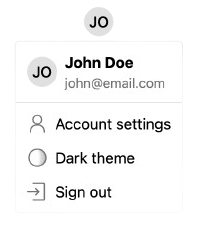

In [the last guide](./setup.mdx), we initialized Stack. This created new files containing a `StackServerApp` and `StackProvider`. In this section, we will show you how to utilize those for accessing and modifying the current user information on Server Components and Client Components, respectively.

## Use the current user in a client component

We can use the `useStackApp()` hook to get a `StackClientApp` object. With it, we can retrieve the current user in Client Components:

```tsx title="Client user profile"
"use client";
import { useStackApp } from "@stackframe/stack";

export function MyComponent() {
  const app = useStackApp();
  const user = app.useUser();
  return <div>{user ? `Hello, ${user.displayName ?? "anon"}` : 'You are not logged in'}</div>;
}
```

Because it's so common, `useUser()` is also exposed as a standalone hook: `import { useUser } from "@stackframe/stack"`. This is simply a shortcut because `useUser()` is shorter than `useStackApp().useUser()`. (This is not the case with other hooks; most are on the `StackClientApp` object, for example, you must explicitly call `useStackApp().useProject()` versus `useProject()`.)

## Use the current user in a server component

On Server Components, you don't need `useStackApp()`. Instead, you can just import the `StackServerApp` that you created in the previous chapter (usually you would find it in the root or `src` directory):

```tsx title="Server user profile"
import { stackServerApp } from "@/stack";

export default async function MyComponent() {
  const user = await stackServerApp.getUser();
  return <div>{user ? `Hello, ${user.displayName ?? "anon"}` : 'You are not logged in'}</div>;
}
```

<Note>
The difference between `getUser()` and `useUser()` is that `useUser()` will re-render the component when the user changes (for example on signout), while `getUser()` will only fetch the user once. Since Server Components cannot re-render, `useUser()` cannot be used there. 
</Note>


## Protecting a page

There are three ways to protect a page: Using middleware, in Client Components with `useUser({ or: "redirect" })`, and in Server Components with `await getUser({ or: "redirect" })`.

Middleware can be used whenever it is easy to tell whether a page should be protected given just the URL, for example you have a `/private` section only accessible to logged-in users.

On Client Components, the `useUser({ or: 'redirect' })` hook will redirect the user to the sign-in page if they are not logged in. Similarly, on Server Components, call `await getUser({ or: "redirect" })` to protect a page (or component).

<Tabs>
  <Tab title="Middleware">
    ```tsx title="middleware.tsx"
    "use client";
    import { useUser } from "@stackframe/stack";

    export default function Protected() {
      useUser({ or: 'redirect' });
      return <h1>You can only see this if you are logged in</h1>
    }
    ```
  </Tab>

  <Tab title="Client Component">
    ```tsx title="my-component.tsx"
    "use client";
    import { useUser } from "@stackframe/stack";

    export default function Protected() {
      useUser({ or: 'redirect' });
      return <h1>You can only see this if you are logged in</h1>
    }
    ```
  </Tab>

  <Tab title="Server Component">
    ```tsx title="my-component.tsx"
    import { stackServerApp } from "@/stack";

    export default async function Protected() {
      await stackServerApp.getUser({ or: 'redirect' });
      return <h1>You can only see this if you are logged in</h1>
    }
    ```
  </Tab>
</Tabs>

<Note>
  If you have sensitive information hidden in the page HTML itself, be aware of Next.js differences when using Server vs. Client Components. Irregardless of which method you use, attackers will never be able to, say, impersonate a user.

  **Server Components**: Next.js may send individual components on the same page to the client separately. For example, if you have two files `layout.tsx` (protected) and `page.tsx` (not protected), the bundled HTML of the `page.tsx` may still be sent to the browser even if the user is not logged in. (Normal browsers will never display it, but attackers may be able to retrieve it.)
  
  To remediate this, every component that contains sensitive information should be protected, not just the page/layout. Usually, this is quite natural, as you need the `User` object to retrieve sensitive data anyways.

  **Client Components**: Client components are always sent to the user, regardless of page protection. This is standard Next.js behavior. For more information, please refer to the [Next.js documentation](https://nextjs.org/docs/app/building-your-application/rendering/composition-patterns#keeping-server-only-code-out-of-the-client-environment). (Again, this will not allow attackers to impersonate a user).
</Note>


## Signing out

You can sign out the user by redirecting them to `/handler/signout` or simply by calling `user.signOut()`. They will be redirected to the URL [configured as `afterSignOut` in the `StackServerApp`](/docs/api-documentation/app).

<Tabs>
  <Tab title="user.signOut()">
    ```tsx title="Sign-out button"
    "use client";
    import { useUser } from "@stackframe/stack";

    export default function SignOutButton() {
      const user = useUser();
      return user ? <button onClick={() => user.signOut()}>Sign Out</button> : "Not signed in";
    }
    ```
  </Tab>

  <Tab title="Redirect">
    ```tsx title="Sign-out link"
    import { stackServerApp } from "@/stack";

    export default async function SignOutLink() {
      return <a href={stackServerApp.urls.signOut}>Sign Out</a>;
    }
    ```
  </Tab>
</Tabs>


## Example Profile Page

Stack automatically creates a user profile on sign-up. Let's create a page that displays this information. In `app/profile/page.tsx`:

<Tabs>
  <Tab title="Client Component">
    ```tsx title="Client profile page"
    'use client';
    import { useUser, useStackApp, UserButton } from "@stackframe/stack";

    export default function PageClient() {
      const user = useUser();
      const app = useStackApp();
      return (
        <div>
          {user ? (
            <div>
              <UserButton />
              <p>Welcome, {user.displayName}</p>
              <p>Your e-mail: {user.primaryEmail}</p>
              <button onClick={() => user.signOut()}>Sign Out</button>
            </div>
          ) : (
            <div>
              <p>You are not logged in</p>
              <button onClick={() => app.redirectToSignIn()}>Sign in</button>
              <button onClick={() => app.redirectToSignUp()}>Sign up</button>
            </div>
          )}
        </div>
      );
    }
    ```
  </Tab>

  <Tab title="Server Component">
    ```tsx title="Server profile page"
    import { stackServerApp } from "@/stack";
    import { UserButton } from "@stackframe/stack";

    export default async function Page() {
      const user = await stackServerApp.getUser();
      return (
        <div>
          {user ? (
            <div>
              <UserButton />
              <p>Welcome, {user.displayName}</p>
              <p>Your e-mail: {user.primaryEmail}</p>
              <p><a href={stackServerApp.urls.signOut}>Sign Out</a></p>
            </div>
          ) : (
            <div>
              <p>You are not logged in</p>
              <p><a href={stackServerApp.urls.signIn}>Sign in</a></p>
              <p><a href={stackServerApp.urls.signUp}>Sign up</a></p>
            </div>
          )}
        </div>
      );
    }
    ```
  </Tab>
</Tabs>

Note the `UserButton` is a component that you normally put in the top right corner of your page. It shows the user's profile picture (and optionally their name) and opens a dropdown with the user's profile, account settings, and sign-out button. It looks like this:



You will now be able to see the new profile page on [http://localhost:3000/profile](http://localhost:3000/profile).

To see more examples of how to use the `User` object, check out the [User API documentation](../sdk/user.mdx).

## Custom User Information

You can update the user's information by calling `user.update()` with the new data. The user data from the `userUser()` hook will also be updated automatically. Here is an example:

```tsx title="Update user display name"
'user client';
import { useUser } from "@stackframe/stack";

export default function UpdateUser() {
  const user = useUser();
  return <button onClick={async () => await user.update({ displayName: "New Name" })}>
    Change Name
  </button>;
}
```

You can store custom data in the `clientMetadata` field. Note that this data is visible on the client side and should not contain any sensitive information.

```tsx title="Store client metadata"
await user.update({
  clientMetadata: {
    mailingAddress: "123 Main St",
  },
});
```

You can then get the `clientMetadata` field from the `User` object:

```tsx title="Read client metadata"
const user = useUser();
console.log(user.clientMetadata);
```

If you want to store sensitive information that is only visible on the server side, you can use the `serverMetadata` field. This data will not be sent accessible on the client side. So you also have to use the `getUser()` on the `StackServerApp` to access this data.

```tsx title="Store server metadata"
// server side only
import { stackServerApp } from "@/stack";
const user = await stackServerApp.getUser();
await user.update({
  serverMetadata: {
    secretInfo: "This is a secret",
  },
});
```

You can also access them from the `User` object:

```tsx title="Read server metadata"
// server side only
import { stackServerApp } from "@/stack";
const user = await stackServerApp.getUser();
console.log(user.serverMetadata);
```

