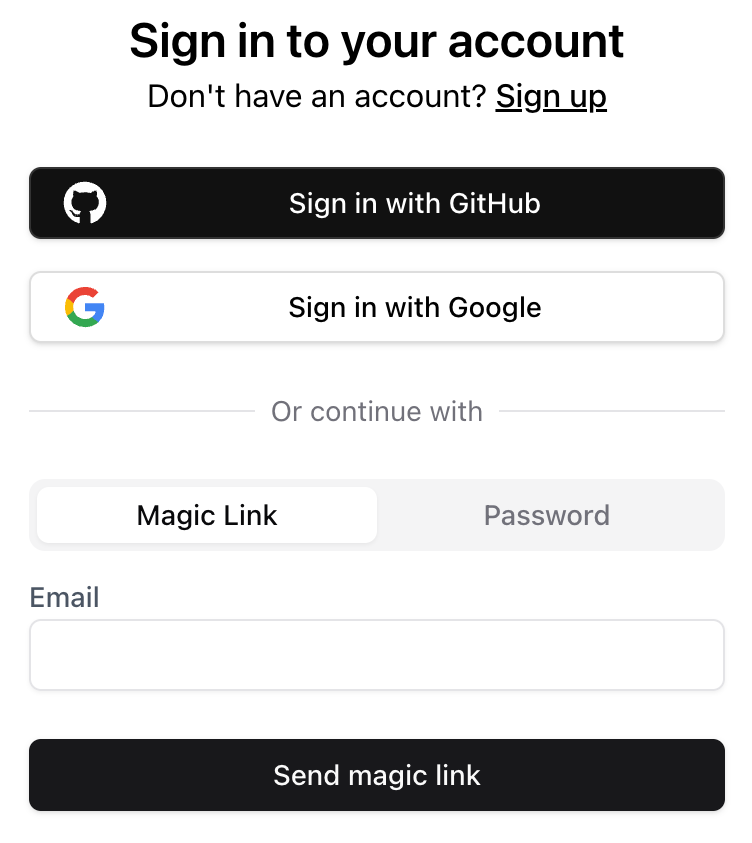

The `SignIn` component is a pre-built UI element that displays all available sign-in methods as configured in the Stack dashboard.

<Note>
  This component does not redirect a signed-in user. To achieve automatic redirection for signed-in users, you can use the `useUser` hook to check the user's sign-in status and perform the redirection if necessary.
</Note>

## Props
- `fullPage` (boolean): Determines whether the component should occupy the full page. Default is `false`.