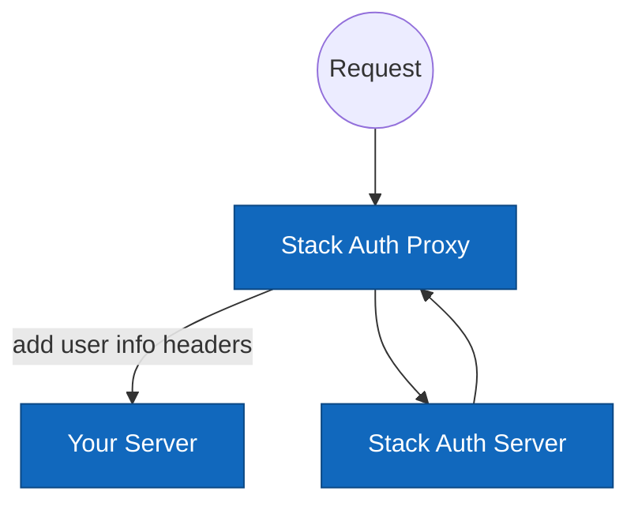

# Stack Auth Proxy

Stack Auth Proxy is a simple proxy authenticates your http requests and redirect to a sign-in page if the user is not authenticated. You can use it as a reverse proxy of any static website and immediately get your auth setup with one command.

## Setup

First create your API keys on [Stack Auth dashboard](https://app.stack-auth.com) and get your environment variables (note that Stack Auth is open-source and also self-hostable, more details [here](https://github.com/stack-auth/stack))

```sh
STACK_PROJECT_ID=<your-project-id> && \
STACK_PUBLISHABLE_CLIENT_KEY=<your-client-key> && \
STACK_SECRET_SERVER_KEY=<your-server-key> && \
npx stack-auth-proxy \
  --server-port <port-to-your-http-server> \
  --proxy-port <port-you-want-to-access-you-website-with>
```

You can also pass in a glob style pattern `--protected-pattern` to decide which route to protect. By default it will protect all the routes.

<details>
  <summary>If you don't have a website, you can run our example server to play around with the proxy</summary>

Start the example server on port 3000
```sh
git clone https://github.com/stack-auth/stack-auth-proxy.git
cd stack-auth-proxy/example-express-server
npm install
PORT=3000 && node server.js
```

Now open a new terminal and run the proxy server on port 3001:

```sh
STACK_PROJECT_ID=<your-project-id> && \
STACK_PUBLISHABLE_CLIENT_KEY=<your-client-key> && \
STACK_SECRET_SERVER_KEY=<your-server-key> && \
npx stack-auth-proxy \
  --server-port 3000 \
  --proxy-port 3001 \
  --protected-pattern "/protected**"
```

You can play with the proxy on [localhost:3001](http://localhost:3001)
</details>

## What you get

If you access a protected page from the proxy without being authenticated, you will be redirected to a sign-in page like this (the sign-in methods are customizable on the dashboard):

<div align="center">

</div>

After signing in, you should be able to access the protected pages. To get user information from your static website, you can read the headers like this (example in JS express, but it's the same idea in any other languages and frameworks):

```js
app.get('/', (req, res) => {
  const authenticated = req.headers['x-stack-authenticated'];
  const displayName = req.headers['x-stack-user-display-name'];
  res.send(`
    <div>
      <p>Authenticated: ${authenticated ? "Yes" : "No"}</p>
      ${authenticated ? `<p>Display Name: ${displayName}</p>` : ""}
      ${authenticated ? `<p><a href="/handler/account-settings">Account Settings</a></p>` : "<p><a href="/handler/sign-in">Sign In</a></p>"}
    </div>
  `);
});
```

Headers available:

- `x-stack-authenticated`: "true" or not present, whether the user is authenticated
- `x-stack-user-id`
- `x-stack-user-primary-email`
- `x-stack-user-display-name`
- `x-stack-user-profile-image-url`

URLs available (you can just redirect to these URLs in your app server):

- `/handler/sign-in`
- `/handler/sign-up`
- `/handler/sign-out`: This will clear the cookies and redirect back to your homepage
- `/handler/account-settings`: a page where users can update their email, display name, password, etc.

## How it works

When ever a request comes in, the logic is as follows:

```
if url is /handler/*:
  render the auth pages
else:
  if user is not authenticated && url is protected:
    redirect to /handler/sign-in
  else:
    forward the request to your server with the user info headers
```


