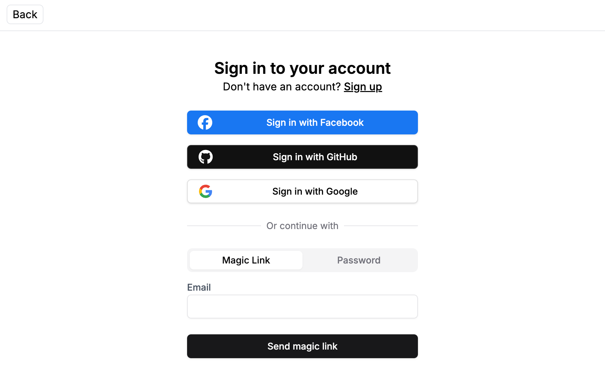

# Stack Auth Proxy

Stack Auth Proxy is a simple one-command proxy that authenticates your HTTP requests and redirects to a pre-built sign-in page if a user is not authenticated.

## Setup

First, create your API keys on the [Stack Auth Dashboard](https://app.stack-auth.com) and retrieve your environment variables. Note that Stack Auth is open-source and can be self-hosted; more details are available [here](https://github.com/stack-auth/stack).

```sh
STACK_PROJECT_ID=<project-id> && \
STACK_PUBLISHABLE_CLIENT_KEY=<client-key> && \
STACK_SECRET_SERVER_KEY=<server-key> && \
npx @stackframe/stack-proxy \
  -s <port-to-your-http-server> \
  -p <port-to-access-your-website-with>
```

You can also use a glob-style pattern with `-u` to specify which routes to protect. By default, all routes are protected.

<details>
  <summary>If you don't have a website, you can run our example server to play around with the proxy</summary>

Start the example server on port 3000:
```sh
PORT=3001 && npx @stackframe/proxied-server-example
```

You can check out the original server without the proxy at [localhost:3001](http://localhost:3001).

Now, open a new terminal and run the proxy server on port 3000:

```sh
STACK_PROJECT_ID=<project-id> && \
STACK_PUBLISHABLE_CLIENT_KEY=<client-key> && \
STACK_SECRET_SERVER_KEY=<server-key> && \
npx @stackframe/stack-proxy \
  -s 3001 \
  -p 3000 \
  -u "/protected**"
```

You can explore the proxy at [localhost:3000](http://localhost:3000).
</details>

## What You Get

If you access a protected page through the proxy without being authenticated, you will be redirected to a sign-in page like this (customizable on the dashboard):

<div align="center">

</div>

After signing in, you will be able to access the protected pages. To retrieve user information from your webpage, you can read the headers as shown in this JavaScript Express example (works similarly on other languages/frameworks):

```js
const handlebars = require('handlebars');
const template = handlebars.compile(`
  <div>
    {{#if authenticated}}
      <p>Name: {{displayName}}</p>
      <p><a href="/handler/account-settings">Account Settings</a></p>
    {{else}}
      <p><a href="/handler/sign-in">Sign In</a></p>
    {{/if}}
  </div>
`);

app.get('/', (req, res) => {
  const authenticated = !!req.headers['x-stack-authenticated'];
  const displayName = req.headers['x-stack-user-display-name'] || '';
  const html = template({ authenticated, displayName });
  res.send(html);
});

Available headers:

- `x-stack-authenticated`: "true" if authenticated; not present otherwise.
- `x-stack-user-id`
- `x-stack-user-primary-email`
- `x-stack-user-display-name`

Available URLs (redirect your app server to these URLs as needed):

- `/handler/sign-in`
- `/handler/sign-up`
- `/handler/sign-out`: Clears cookies and redirects back to your homepage.
- `/handler/account-settings`: Users can update their email, display name, password, etc.

## How It Works

When a request is received, the logic is as follows:

```
if url is /handler/*:
  render the auth pages
else:
  if user is not authenticated && url is protected:
    redirect to /handler/sign-in
  else:
    forward the request to your server with user info headers
```


This diagram illustrates the request flow and interactions between the client, the proxy, your server, and the Stack Auth server.